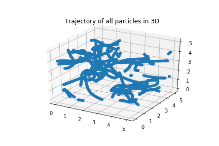
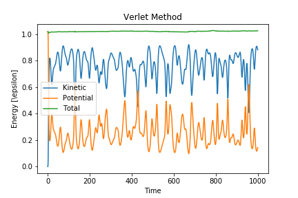
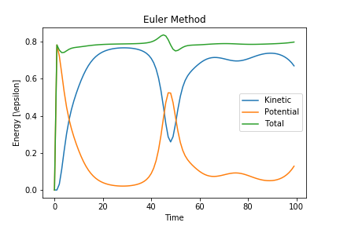
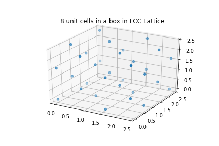
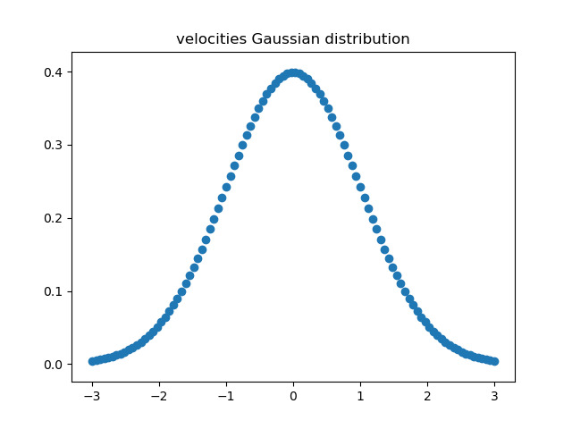
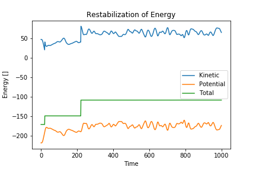

# Weekly progress journal

## Instructions

In this journal you will document your progress of the project, making use of the weekly milestones.

Every week you should 

1. write down **on Wednesday** a short plan (bullet list is sufficient) of how you want to 
   reach the weekly milestones. Think about how to distribute work in the group, 
   what pieces of code functionality need to be implemented. 
2. write about your progress **before** the Tuesday in the next week with respect to the milestones.
   Substantiate your progress with links to code, pictures or test results. Reflect on the
   relation to your original plan.

We will give feedback on your progress on Tuesday before the following lecture. Consult the 
[grading scheme](https://computationalphysics.quantumtinkerer.tudelft.nl/proj1-moldyn-grading/) 
for details how the journal enters your grade.

Note that the file format of the journal is *markdown*. This is a flexible and easy method of 
converting text to HTML. 
Documentation of the syntax of markdown can be found 
[here](https://docs.gitlab.com/ee/user/markdown.html#gfm-extends-standard-markdown). 
You will find how to include [links](https://docs.gitlab.com/ee/user/markdown.html#links) and 
[images](https://docs.gitlab.com/ee/user/markdown.html#images) particularly
useful.

## Week 1
(due before 18 February)

- We will store each particles velocity and postion in a 1xN dimensional array. For the initial values we will use a gaussian distribution. This will be done by Kadhim

- first differentiate the lennard jones potential analytically, then we use that to calculate the force. For this we need the distance for the nearest neighbor. We will examine the elements of the position vector and subtract each element to get the shortest distance. This will be done by Achmed

-  for this task a for loop will be used to calculate the time evolution for both position and velocity. This will be done by Kadhim

- We set up a box of lenght L. Once a particle crosses the boundary we will subtract the length of the box to that particle. This will be done by Achmed

- The energy function will consist of the kinetic energy and potential(lennard jones potential). This will be done by both of us

#Progress:

- At first, the packages numpy and matplotlib.pyplot were imported. The next step is to define all functions beforehand to be able to recall them later.

- input parameters such as box lentgh, number of particles, time steps and constants (SI units) are then defined.

- Position and velocity arrays were defined for a 2D problem. For that np.random is used which is based on a uniform distribution.

- In order to keep track of the system, 2 atoms were used instead of 100. 

- The analytical expression for the potential energy (Lennard Jones) is used to determine the force. This is done by a matrix calculation instead of using a for loop.

- The position matrix is filled with 1's on the diagonal to avoid division by zero. This is set again to zero after the division.

- The modules is used to implement the periodic boundry conditions. If x is longer then the side lentgh of the box, the the "rest" (modules) will be taken as numerical value. This again to avoid using for loop.

- For the evolution in time The Euler method is used. A for loop is used for the arrays to evolve in time. 

- At the end the function of the total energy is recalled and all numerical data can be printed. 

- low values for the energies were to expect since SI units are used. 

## Week 2
(due before 25 February)

- First we are going to generalize the code by defining matrices instead of column vectors for each direction.

- An analytical epxression will be derives for the kinetic energy.

- A new expression will be derived for the position, momentum and the time in order to change the molucialr dynamics representation of the problem.

- Our is to use the modules method the impliment the minimal image convention.

- A new dimension will be added to the code in order to be a 3D problem. Depending op bullet point 3, we will discuss a suitable size for the box. We may also change the distrubtion of the particles in order to be close to the boundary of the box.

- The new position coordinates that evolves in time will be stored in a array to keep track of the system.

#Progress:

- A general matrix is defined for the different directions, as follows:
    
    r = np.zeros((N, D, Timesteps))
    r[:,:,0] = createCoordinate(N, D)

- A new function is defined for the unitless expression for the kinetic energy:

    def kinet_en(mass, v_tilde):
        T_tilde = 0.5*mass*v_tilde**2

- All the relevant quantities are scaled to be unitless.

- the lectures notes are used to derive an expression for the minimal image convention.

- it is possible to expand the dimensions to any preferable size.

- A matrix is made in order to store the time evolution of the system:

    r_tilde = np.zeros((N, D, Timesteps))
    r_tilde[:,:,0] = unitless_r(r[:,:,0], sigma).
    
- A nice animation is added to the main page.

## Week 3
- The extension of the particles to 3D will be done by Ahmed.

- The velocity-Verlet algorithm will be emplimented by Achmed.

- The investigation of the total energy and the plots will be done by Kadhim.

- Comparison of the results (Euler and Verlet) will be done by Kadhim.

# Progress:

- The code has been simulated for five particles in 3D.

- The verlet has been implemented in the for loop of the time steps and the comparison between bothe methods can be checked.

# verlet algorithm
    r[:,:,i] = r[:,:,i-1] + dt*v + 0.5*calculateForce(r[:,:,i-1])*dt**2
    r[:,:,i] = r[:,:,i]%L
    v = v + 0.5*dt*(calculateForce(r[:,:,i])+ calculateForce(r[:,:,i-1]) )

- Invetigation of the total energies of both methods, one can clearly observe that the energy using the Euler method is not constant while it is constant for the Verlet method.

- The energies are plotted for both methods and are compared to each other.

## Week 4
- The initialization of positions onto an fcc lattice will be done by Achmed.

- The initial velocities obey a Maxwell-Boltzmann distribution will be done by Kadhim.

- the rescaling of temperature and show how the desired temperature is attained after a certain amount of rescaling and equilibrating by Achmed.

- Studying the observables and comparison by the literature will be done by Kadhim.

# Progress:

- The positions of the atoms are distributed onto a FCC lattice.

- A normal distribuation is generated using SCIPY to observe the inititial velocities obeying the Maxwell-Boltzmann distribution.

- Stabilization of the energy to obtain the correct temperature is implimented.

- The specific heat according to Lebowitz is computed and the value is 104 in natural units.

        
average = 1/Timesteps*np.sum(kineticE)
var = 1/Timesteps*np.sum(kineticE**2) - average**2
A = var/average**2

cv = (A- 2/(3*N))**(-1)
print(cv)

## Week 5
(due before 17 March)
